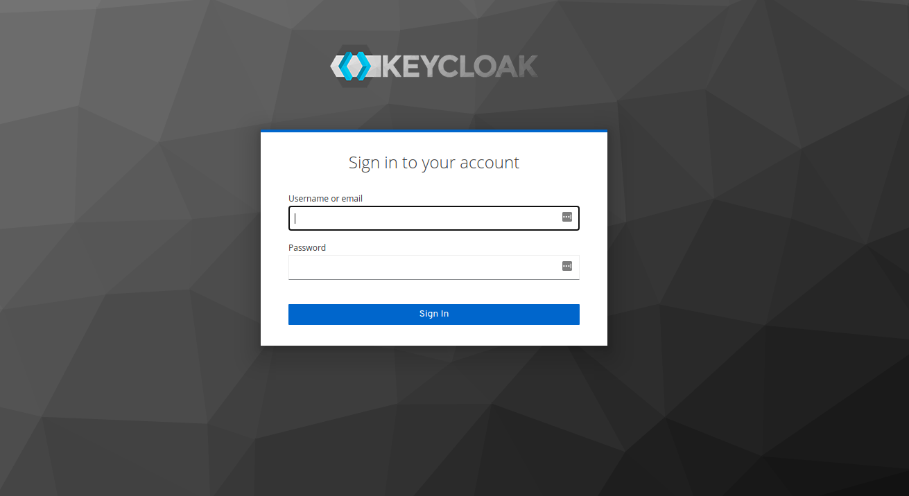

# Keycloak

## 🌱 Projeto

- Playbook para subir o Keycloak, que é um software open source (https://github.com/keycloak/keycloak) de um servidor JBoss feito para trabalhar em conjunto com sua aplicação em implementações mais comuns de autenticação e autorização. Caso as configurações padrão não te atendam, existem várias configurações e customizações que podem ser feitas para adequar o funcionamento ao seu sistema.

## Tecnologias

- Ansible
- Docker
- Vagrant
- Virtual Box
- Python 3
- Keycloak
- Postgresql

## Playbook

- Subindo o banco `Postgresql`

```bash
ansible-playbook -i inventories/virtualbox.yml site.yml --tags pgsql
```

- Configurando o Host

```bash
ansible-playbook -i inventories/virtualbox.yml site.yml --tags setup
```

- Subindo o Keycloak

```bash
ansible-playbook -i inventories/virtualbox.yml site.yml --tags keycloak
```

## Acesso

- http://192.168.10.3:8089/


- Login

